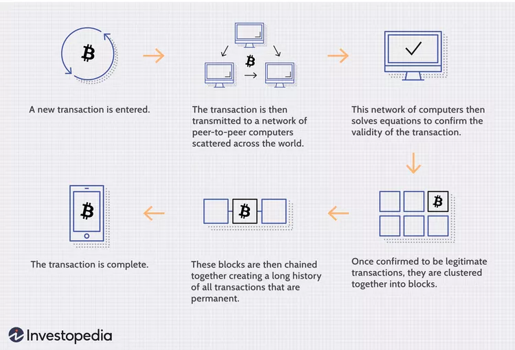

# Blockchain

## What is blockchain
- Distributed database or ledger shared among a computer network's notes.
## Keys takeaways
- Blockchain is a type of shared database that differs from a typical database in the way it stores information; blockchains store data in blocks linked together via cryptography.
- Different types of information can be stored on a blockchain, but the most common use for transactions has been as a ledger. 
- In Bitcoin’s case, blockchain is decentralized so that no single person or group has control—instead, all users collectively retain control.
- Decentralized blockchains are immutable, which means that the data entered is irreversible. For Bitcoin, transactions are permanently recorded and viewable to anyone.

## How Does a Blockchain Work?
- A blockchain is a database where information is entered and stored
- It consists of programs called scripts that conduct the tasks we usually would do in a database. Entering and accessing information and saving and storing it somewhere.
- A blockchain is distributed, which means multiple copies are saved on many machines, and they must all match for it to be valid.
- The blockchain collects transaction information and enters it into a block, like a cell in a spreedsheet containing information. Once it's full, the information is run through an encryption algorithm, which creates a hexadecimal number called the hash.
The has is then entered into the following block header and encrypted with the other information in the block. This creates a series of blocks that are chained together.

## Transaction 
 

 